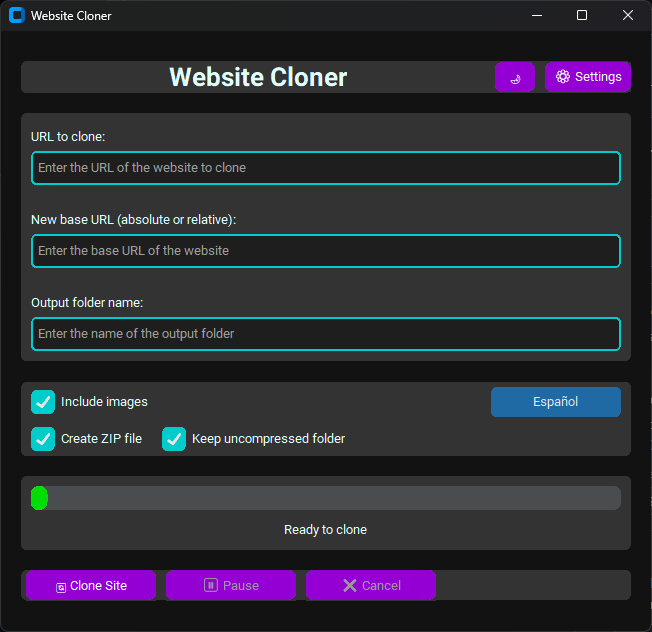

# Web Cloner

A user-friendly application to clone websites with a modern graphical interface.



## Features

- Clone entire websites with a single click
- Modern user interface with visual customization
- Option to include or exclude images
- Ability to pause and cancel the cloning process
- Automatically cleans temporary files when canceled
- Multi-language support (English and Spanish)
- Options to create ZIP files and/or keep uncompressed folders
- Dark and light themes with custom styles
- Support for absolute and relative URLs

## Requirements

- Python 3.6+
- Python libraries (installable with pip):
  - customtkinter
  - requests
  - beautifulsoup4

## Installation from source code

1. Clone this repository:
   ```
   git clone https://github.com/CripterHack/web-cloner.git
   cd web-cloner
   ```

2. Install dependencies:
   ```
   pip install -r requirements.txt
   ```

3. Run the application:
   ```
   python web-cloner.py
   ```

## Creating executables

### Windows (.exe)

To create a Windows executable:

1. Make sure you have PyInstaller installed: `pip install pyinstaller`
2. Run the build script:
   ```
   .\build_windows.bat
   ```
3. The executable will be generated in the `dist\Web Cloner\` folder

### Linux (.AppImage)

To create a Linux AppImage:

1. Make sure the script has execution permissions: `chmod +x build_linux.sh`
2. Run the build script:
   ```
   ./build_linux.sh
   ```
3. The AppImage file will be generated in the root directory

### macOS (.dmg)

To create a macOS DMG file:

1. Make sure you have Homebrew installed: https://brew.sh/
2. Install create-dmg: `brew install create-dmg`
3. Make sure the script has execution permissions: `chmod +x build_macos.sh`
4. Run the build script:
   ```
   ./build_macos.sh
   ```
5. The DMG file will be generated in the `dist/` folder

## Creating a GitHub Release

To create a GitHub release with the generated executables:

1. Go to your repository page on GitHub
2. Click on "Releases" in the right sidebar
3. Click on "Draft a new release"
4. Add a version number (e.g., v1.0.0)
5. Add a title and description for the release
6. Drag and drop or manually select the generated executable files:
   - Windows: `Web Cloner.exe` (or the ZIP folder containing it)
   - Linux: `Web-Cloner-x86_64.AppImage`
   - macOS: `Web Cloner.dmg`
7. Check the "This is a pre-release" option if it's a preliminary version
8. Click on "Publish release"

## Usage

1. Enter the URL of the website you want to clone
2. Enter the base URL for the cloned site links (can be relative or absolute)
3. Set the output folder name (optional)
4. Select additional options (include images, create ZIP, keep folder)
5. Click on "Clone Site"
6. Wait for the process to complete and enjoy your cloned site!

## Support the Project

If you find this project useful, you can support it in the following ways:

- [Sponsor on GitHub](https://github.com/sponsors/CripterHack)
- [Donate via PayPal](https://www.paypal.com/paypalme/cripterhack)

Your support helps maintain and improve this project!

## License

This project is licensed under the MIT License - see the [LICENSE](LICENSE) file for details.

## Contributions

Contributions are welcome. For major changes, please open an issue first to discuss what you would like to change.
